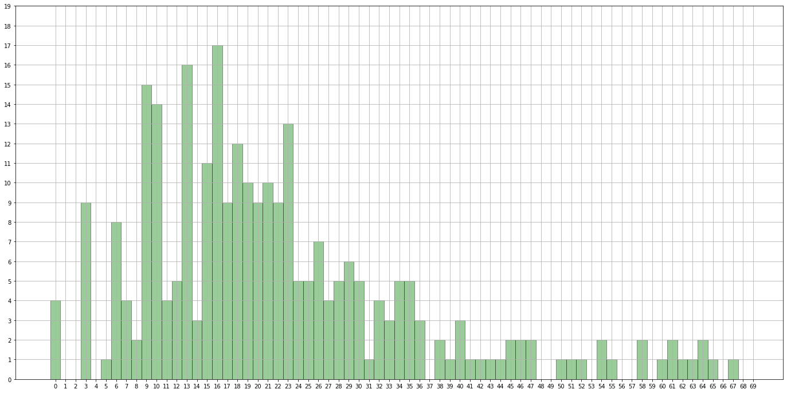
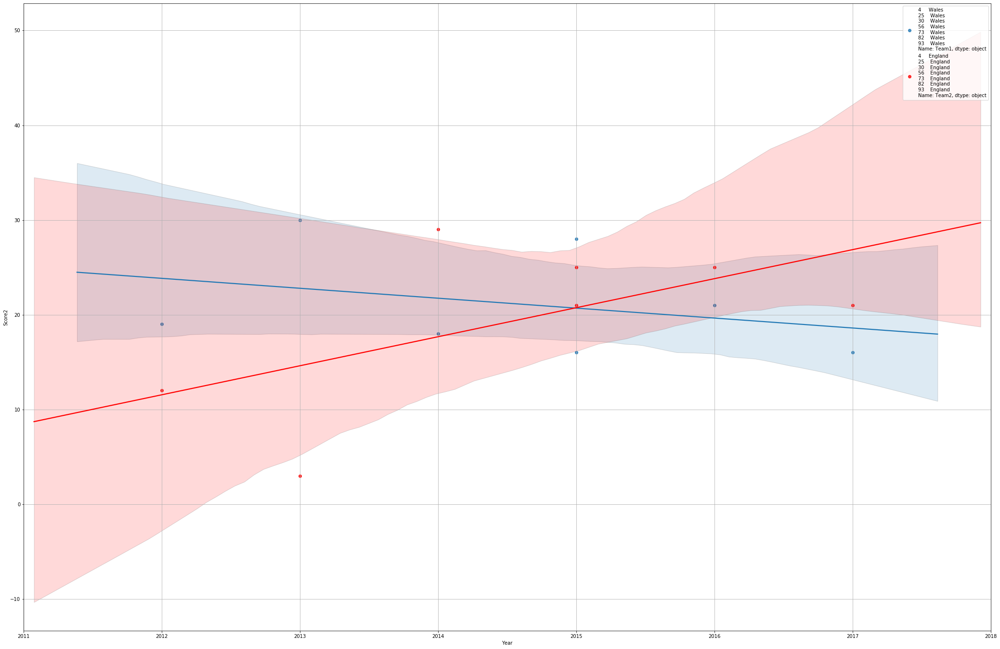

# Rugby Data Experiment


```python
import pandas as pd
import numpy as np
import matplotlib.pyplot as plt
import seaborn as sns
%matplotlib inline
plt.rcParams["patch.force_edgecolor"] = True

pd.options.mode.chained_assignment = None  # default='warn'
```


```python
rugby = pd.read_csv("RugbyData.csv")
rugby.head(5)
```


<div>
<style scoped>
    .dataframe tbody tr th:only-of-type {
        vertical-align: middle;
    }

    .dataframe tbody tr th {
        vertical-align: top;
    }

    .dataframe thead th {
        text-align: right;
    }
</style>
<table border="1" class="dataframe">
  <thead>
    <tr style="text-align: right;">
      <th></th>
      <th>Team1</th>
      <th>Score1</th>
      <th>Score2</th>
      <th>Team2</th>
      <th>Year</th>
    </tr>
  </thead>
  <tbody>
    <tr>
      <th>0</th>
      <td>Scotland</td>
      <td>27</td>
      <td>22</td>
      <td>Ireland</td>
      <td>2017</td>
    </tr>
    <tr>
      <th>1</th>
      <td>England</td>
      <td>19</td>
      <td>16</td>
      <td>France</td>
      <td>2017</td>
    </tr>
    <tr>
      <th>2</th>
      <td>Italy</td>
      <td>7</td>
      <td>33</td>
      <td>Wales</td>
      <td>2017</td>
    </tr>
    <tr>
      <th>3</th>
      <td>Italy</td>
      <td>10</td>
      <td>63</td>
      <td>Ireland</td>
      <td>2017</td>
    </tr>
    <tr>
      <th>4</th>
      <td>Wales</td>
      <td>16</td>
      <td>21</td>
      <td>England</td>
      <td>2017</td>
    </tr>
  </tbody>
</table>
</div>


## All_Scores is a series made from the Score1 and Score2 columns


```python
All_Scores = rugby['Score1'].append(rugby['Score2'])
All_Scores
```


    0      27
    1      19
    2       7
    3      10
    4      16
    5      22
    6      29
    7      19
    8      36
    9      22
    10     18
    11     61
    12     29
    13     20
    14     13
    15     23
    16      9
    17     16
    18     10
    19     27
    20      9
    21     19
    22     20
    23     21
    24     58
    25     25
    26     29
    27     67
    28     35
    29     21
           ..
    108    36
    109    28
    110    17
    111    16
    112    14
    113     9
    114    21
    115    10
    116    16
    117    17
    118     9
    119    19
    120     7
    121    10
    122    11
    123    18
    124    10
    125    18
    126     9
    127    17
    128    22
    129    24
    130    19
    131    13
    132    43
    133    34
    134    20
    135    29
    136    13
    137    17
    Length: 276, dtype: int64


## Countplot for scores


```python
fig1 = plt.figure(figsize=(24,12))
ax = sns.distplot(All_Scores, bins=np.arange(70)-0.5, kde=False, color = 'g')
ax.set(xticks=range(0,70))
ax.set(yticks=range(0,20))
ax.grid()
```





```python
most_freq = All_Scores.value_counts()
for score, count in most_freq.head(10).iteritems():
    print("{} has occurred {} times".format(score, count))
```

    16 has occurred 17 times
    13 has occurred 16 times
    9 has occurred 15 times
    10 has occurred 14 times
    23 has occurred 13 times
    18 has occurred 12 times
    15 has occurred 11 times
    19 has occurred 10 times
    21 has occurred 10 times
    20 has occurred 9 times
    

#### Common scores seen in the ranges 9-10, 12-13, 15-23, 26-30

## Team Specifics

## Function to return match history of 2 teams


```python
def match_history(country1, country2):
    games1 = rugby[(rugby['Team1']==country1) & (rugby['Team2']==country2)]
    games2 = rugby[(rugby['Team2']==country1) & (rugby['Team1']==country2)]
    c = games2.columns
    games2[[c[0], c[3]]] = games2[[c[3], c[0]]]
    games2[[c[1], c[2]]] = games2[[c[2], c[1]]]
    games = games1.append(games2)
    games.sort_index(inplace=True)
    return games
```


```python
mh = match_history("Wales", "England")
mh
```


<div>
<style scoped>
    .dataframe tbody tr th:only-of-type {
        vertical-align: middle;
    }

    .dataframe tbody tr th {
        vertical-align: top;
    }

    .dataframe thead th {
        text-align: right;
    }
</style>
<table border="1" class="dataframe">
  <thead>
    <tr style="text-align: right;">
      <th></th>
      <th>Team1</th>
      <th>Score1</th>
      <th>Score2</th>
      <th>Team2</th>
      <th>Year</th>
    </tr>
  </thead>
  <tbody>
    <tr>
      <th>4</th>
      <td>Wales</td>
      <td>16</td>
      <td>21</td>
      <td>England</td>
      <td>2017</td>
    </tr>
    <tr>
      <th>25</th>
      <td>Wales</td>
      <td>21</td>
      <td>25</td>
      <td>England</td>
      <td>2016</td>
    </tr>
    <tr>
      <th>30</th>
      <td>Wales</td>
      <td>16</td>
      <td>21</td>
      <td>England</td>
      <td>2015</td>
    </tr>
    <tr>
      <th>56</th>
      <td>Wales</td>
      <td>18</td>
      <td>29</td>
      <td>England</td>
      <td>2014</td>
    </tr>
    <tr>
      <th>73</th>
      <td>Wales</td>
      <td>30</td>
      <td>3</td>
      <td>England</td>
      <td>2013</td>
    </tr>
    <tr>
      <th>82</th>
      <td>Wales</td>
      <td>19</td>
      <td>12</td>
      <td>England</td>
      <td>2012</td>
    </tr>
    <tr>
      <th>93</th>
      <td>Wales</td>
      <td>28</td>
      <td>25</td>
      <td>England</td>
      <td>2015</td>
    </tr>
  </tbody>
</table>
</div>


```python
print("Mean scores are {} {}".format(mh['Score1'].mean(), mh['Score2'].mean()))
```

    Mean scores are 21.142857142857142 19.428571428571427
    

#### Here we will create a regression plot of the scores from a pair of teams' match history


```python
fig, ax = plt.subplots(figsize=(36,24))
p = sns.regplot(x='Year', y='Score1', data=mh, ax=ax, label=mh['Team1'])
p2 = sns.regplot(x='Year', y='Score2', data=mh, ax=ax, label=mh['Team2'], color='r')
plt.xlim(2011, 2018)
ax.grid()
ax.legend(loc="best")
```


    <matplotlib.legend.Legend at 0x15e650d5588>





```python

```


```python

```


```python

```
